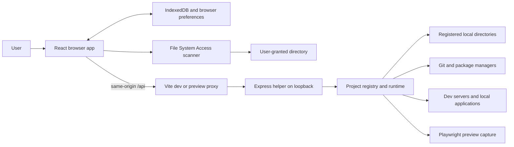

# Architecture

Local Repos is a local project library. It discovers repositories, presents their
metadata and maintenance reports, and optionally runs local development tools.
It has a browser app and an optional Node.js helper in one npm package. There is
no remote application backend, account system, or server database.

## Runtime boundaries

| Mode | Data access | Available operations |
| --- | --- | --- |
| Demo | Sample projects in [demo.ts](../src/lib/demo.ts) | Explore the interface before connecting a directory. |
| Browser directory | A user-granted, read-only `FileSystemDirectoryHandle` | Bounded metadata scanning and cached browsing; no subprocesses or absolute paths. |
| Local helper | An absolute directory path registered by scanning | Git CLI metadata, maintenance, development servers, previews, and opening local applications. |
| Vercel-hosted app | Static browser build | Demo, browser directory access, and PWA; helper features require opening the app locally. |

Demo is the absence of a connected workspace. A connected workspace has mode
`browser` or `helper`; hosted deployment is a separate UI capability check in
[deployment.ts](../src/lib/deployment.ts).

For local development, [scripts/dev.mjs](../scripts/dev.mjs) starts Vite at
`127.0.0.1:5180` and the helper at `127.0.0.1:4318`. The browser always calls
same-origin `/api` URLs; [vite.config.ts](../vite.config.ts) forwards them to the
helper. Production preview uses port `4173` and the same proxy, but requires
starting the helper separately.

## Source map

| Location | Responsibility |
| --- | --- |
| [src/main.tsx](../src/main.tsx), [src/App.tsx](../src/App.tsx) | React entry, settings provider, workspace state, navigation, and feature composition. |
| [src/components](../src/components) | Project views, dialogs, reports, progress displays, and reusable UI primitives. |
| [src/hooks](../src/hooks) | Stateful workflows: actions, batches, watcher, filtering, preferences, reminders, and todos. |
| [src/lib](../src/lib) | Parsing and domain logic, browser filesystem access, API client, storage, and configuration. Some pure modules are shared with the helper. |
| [src/types.ts](../src/types.ts) | Shared project, workspace, scan, Git, preview, and maintenance contracts. |
| [server/app.ts](../server/app.ts) | Express API construction, request checks, dispatch, and error responses. |
| [server/scanner.ts](../server/scanner.ts) | Node filesystem discovery, Git metadata, and registered project identity. |
| [server/runtime.ts](../server/runtime.ts) | Process lifecycle, previews, maintenance coordination, and application opening. |
| [server](../server) feature modules | Git queries, package tools, storage, script validation, and preview rendering. |
| [config/site.ts](../config/site.ts), [vite.config.ts](../vite.config.ts), [vercel.json](../vercel.json) | Build metadata, PWA, local proxy, and static hosting. |
| [scripts](../scripts), [design](../design), [public](../public) | Development launcher, brand asset sources, and committed public assets. |

## Data and operation flow

Both scanners produce a `ScanResult` containing `RepoProject[]`, a root name,
scan time, and optional warnings. The frontend wraps it in a `Workspace` with a
connection mode and, for browser access, the directory handle. Both scanners use
[metadata.ts](../src/lib/metadata.ts) and [monorepo.ts](../src/lib/monorepo.ts), so
package parsing and workspace matching are shared across modes.

The browser owns one displayed workspace and its durable cache. The helper keeps
an in-memory registry of scanned projects and runtime resources. A helper action
resolves a registered project ID to a directory, validates it, runs the relevant
service, and returns the changed report or state. The frontend merges successful
results and saves the workspace. Restarting the helper loses its registrations
and runtime resources; the [API client](../src/lib/api.ts) can re-register the
cached helper workspace on demand before retrying an action.

Project identities differ by connection method: browser IDs use the chosen
folder name and relative path, while helper IDs hash the canonical absolute
project path. Favorites, tags, report preservation, and project matching depend
on those IDs. Browser IDs cannot distinguish two roots with the same name and
relative layout. See [frontend state and persistence](frontend.md) before
changing identity or cache behavior.

`monorepo` describes visual grouping as well as declared workspaces. A discovered
subproject with `declaredWorkspace: false` has independent package maintenance.
Declared workspace members share their root's package manager and lockfile.
[workspace.ts](../src/lib/workspace.ts) and `ProjectRegistry.related()` encode
these distinctions for client and helper coordination.

## Constraints to preserve

- Metadata discovery reads bounded files without evaluating project code. It
  skips dependency and build trees; expensive analysis is a separate action.
- Missing or failed reports are not clean results. Successful dated reports and
  cached preview images survive ordinary rescans; dependency updates explicitly
  invalidate reports that no longer describe the changed workspace.
- Browser action guards coordinate one tab, while helper guards protect shared
  project resources. Both layers matter when requests overlap or several tabs
  use the same helper.
- The helper is a local capability boundary: loopback binding, host/origin
  checks, a custom request header, registered IDs, canonical path validation,
  and bounded subprocess execution are part of its design.
- Git summaries and push checks inspect locally available history without
  fetching or pushing. Package registry checks and remote preview capture can
  make network requests. Explicit script and dev-server actions run project
  code; analysis tools can load project configuration.
- Lighthouse frontend audits use the helper's existing dev-server lifecycle and
  owned Chromium browsers. Only recognized frontend startup scripts or explicit
  application URLs qualify, with HTML validation before analysis. Dated results
  and bounded audit details are cached alongside the other project reports.

Details and extension points are covered in [frontend.md](frontend.md) and
[local-helper.md](local-helper.md).

## Build and deployment

The React interface uses TypeScript, Vite, Tailwind CSS, Radix primitives, and
Lucide icons. [index.css](../src/index.css), [theme.css](../src/theme.css), and
feature stylesheets define the interface. Views and filters are React state;
the app has one public route, `/`.

`npm run build` typechecks the app and Node code, then emits the browser app into
`dist/`. It does not produce a deployed helper. Vercel publishes only that static
directory. Site metadata and robots/sitemap output come from `config/site.ts`.
Vite explicitly defines `VITE_VERCEL_HOSTED` for client capability detection;
the metadata plugin emits intended public site information without serializing
the build environment into the browser bundle.

`vite-plugin-pwa` generates the production manifest and service worker. The
service worker caches the interface; IndexedDB stores project data and captured
previews. API responses are not an offline cache. Navigation fallback is limited
to the root page, so unknown paths and `/api` are not rewritten to the app on
static hosting. Installing the PWA does not start or install the Node helper.
