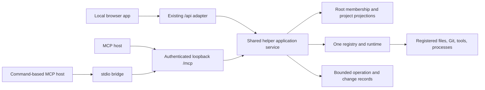

# MCP server plan

Status: phases 0–1 implemented on 2026-10-10; phases 2–5 remain planned.
This document preserves the design proposal below. For shipped configuration,
contracts, limits, and verification status, see [README](../../README.md#optional-mcp-access)
and [helper architecture](../local-helper.md#optional-mcp-read-service).

The initial release includes authenticated HTTP and a stdio bridge, read/discovery/
Git tools, resources, bounded operation polling, and shared root/scope guards.
Official SDK clients cover both transport modes and protocol revisions. External
host application interoperability remains unverified; no universal OAuth support
is claimed. Fresh analysis, browser reconciliation, process controls, mutations,
prompts, and optional protocol extensions are not shipped.

## 1. Recommended direction

Expose Local Repos as a local MCP server backed by the existing helper. Start
with project discovery, bounded project context, cached maintenance reports, and
local Git queries. Add fresh analysis, development operations, and reviewed
dependency changes in separate stages.

The MCP adapter and browser API must share one `ProjectRegistry`, one
`ProjectRuntime`, and the same operation guards. MCP is another client of Local
Repos, not another process manager or repository scanner.

Use an opt-in, authenticated MCP HTTP endpoint on the existing loopback helper.
Offer a thin stdio bridge for clients that need a command-based connection. The
bridge connects to that helper; it never starts an independent runtime. Keep the
static deployment unchanged.

The initial release should answer questions such as:

- Which projects use React, declare a particular package version, or have local
  uncommitted changes?
- What does this repository do, which scripts does it declare, and which
  projects share its package workspace?
- What do the last available audits say, when were they measured, and which
  checks have never run or are no longer valid?
- What changed during a specified day, and which commits appear unpushed based
  on locally available Git refs?

Later releases should support “check these projects,” “start this app and inspect
its logs,” and “prepare these bounded dependency changes for review.” Reading a
report must never implicitly install packages, run analysis, or start a server.

## 2. Existing capabilities and boundaries

Implementation references:
[architecture](../architecture.md), [helper](../local-helper.md),
[frontend](../frontend.md), [shared types](../../src/types.ts),
[HTTP routes](../../server/app.ts), and [runtime](../../server/runtime.ts).

| Area | Existing source and behavior | MCP treatment |
| --- | --- | --- |
| Discovery | `POST /api/scan`; bounded metadata scanner, canonical path IDs, shared metadata/monorepo parsers | Scan configured roots explicitly; list and search the resulting snapshot without rescanning. |
| Project context | Name, description, paths, stack, package metadata, README, AI instruction filenames, scripts, dependency declarations, Git snapshot | Small default projection; separate paginated or bounded detail reads. Instruction filenames are metadata, not instruction content. |
| Cached reports | Storage, audit, outdated, unused, React Doctor, Lighthouse, package update, preview provenance on `RepoProject` | Typed reads with timestamps, availability, invalidation, and last-attempt information. |
| Fresh analysis | `/storage`, `/audit`, `/outdated`, `/unused`, `/react-doctor`, `/lighthouse`, `/screenshot` | Explicit tools using the existing runtime and progress reporters. |
| Git | `/history`, `/daily-summary`, `/push-status` | Local inspection only, preserving shallow/unavailable/unknown-ref states. |
| Development | `/status`, `/logs`, `/start`, `/stop` | Observe or control helper-owned processes; preserve ownership and generation checks. |
| Desktop and scripts | `/open`, `/run-script`; allowlisted apps and validated manifest scripts | Optional capability; acknowledge launch only. Terminal scripts are not tracked jobs. |
| Dependency mutation | `/update-packages`, `/fix-vulnerability`, `/delete-node-modules` | Disabled initially; later expose distinct prepare/apply contracts with bounded targets. |
| Change detection | `/api/package-changes`; stat-based manifest/config fingerprints | Useful for staleness hints, not proof that repository content is unchanged. |
| Search and findings | Pure search/filter, outdated scoring, script discovery, todo and Git aggregation modules | Reuse pure logic, with explicit scoring defaults and coverage. |
| Preferences and durable cache | IndexedDB and localStorage in the browser | Unavailable through the initial MCP server. Do not manufacture empty preferences or claim access to the browser cache. |

Current gaps that must be implemented rather than assumed:

1. There is no general helper project-list, project-detail, or cached-report read
   API. Existing HTTP clients mostly receive data from scans and operations.
2. The registry is additive. Projects missing from a later scan remain registered.
   A list API needs current root membership, not all historical registry entries.
3. The helper loses registrations, reports, logs, and preview files on restart.
   The browser separately persists successful reports and preview data URLs.
4. Favorites, tags, settings, todo dismissals, push-reminder dismissals, and the
   header commit-activity cache are browser-owned. A helper cannot access them
   merely because the UI is open.
5. Existing progress streams are request-scoped NDJSON, not durable jobs. A
   disconnected reader does not cancel shared work.
6. Existing guards coordinate many related-project operations, but admitting a
   new MCP workflow still requires checking every conflict and cleanup path.
7. A metadata rescan preserves absent reports in the browser. External package
   changes need explicit invalidation records or stale reports could reappear.

Browser-directory handles confer no Node filesystem access. MCP exposes only
helper projects under locally configured allowed roots. Demo and hosted-only
workspaces are outside this server's scope.

## 3. Runtime and transport design

### Shared application service



Extract composition and reusable dispatch from `createApp()` into a helper
application service. Keep HTTP status mapping in the REST adapter and MCP result
mapping in the MCP adapter. Call services directly inside the process rather than
making loopback REST requests from tool handlers. Preserve all existing REST
routes and envelopes during extraction.

Proposed module responsibilities, subject to nearby implementation conventions:

| Proposed location | Responsibility |
| --- | --- |
| `server/application.ts` | Construct shared registry/runtime, root index, read projections, and operation coordinator. |
| `server/project-index.ts` | Authorized root membership, revisions, summaries, filtering, and pagination. |
| `server/operations.ts` | Bounded job records, request deduplication, progress, results, and cancellation requests. |
| `server/mcp/server.ts` | Register tools, resource templates, and optional prompts using the official SDK. |
| `server/mcp/schemas.ts` | Runtime input/output schemas and protocol DTO validation. |
| `server/mcp/policy.ts` | Client identity, root/capability permissions, and output disclosure policy. |
| `server/mcp/http.ts` | MCP transport mounting and authentication, separate from the browser's header checks. |
| `server/mcp/stdio.ts` | Protocol-only stdio bridge to an already running, authenticated helper. |
| `server/mcp/maintenance-plans.ts` | Later: expiring, immutable update/cleanup plans and their preconditions. |
| `src/lib/helper-state.ts` | Pure revision/invalidation merge rules shared with frontend consumers. |

These are proposed files, not links to existing implementation. Extend existing
services rather than moving every feature into a new abstraction. Keep MCP SDK
imports server-side. Shared additions to the browser/helper contract belong in
[`src/types.ts`](../../src/types.ts); MCP-specific transport types stay server-side.

### Protocol baseline

Target the **2026-07-28** protocol with the official TypeScript SDK v2. Retain
**2025-11-25** compatibility through the SDK's legacy adapter, tested separately.
Pin a compatible stable SDK release and update `package-lock.json` during
implementation; verify Node 22.12 support before selecting that release. The
[current specification](https://modelcontextprotocol.io/specification/2026-07-28)
and [SDK v2 documentation](https://ts.sdk.modelcontextprotocol.io/v2/) were checked
on 2026-10-10.

Use the SDK HTTP handler and its stateless legacy support instead of writing
version negotiation, initialization, or wire codecs. The current HTTP protocol
and older Streamable HTTP clients have different lifecycle behavior; do not
model application state as a transport session. Keep client policy, operations,
and deduplication independent of transport connection IDs. Use the SDK's
`createMcpHandler` with stateless legacy support, keeping the application service
outside its request-scoped factory. If Express has parsed JSON already, pass the
parsed body through the adapter. Follow the
[SDK HTTP guide](https://ts.sdk.modelcontextprotocol.io/v2/serving/http.html)
and [Express guide](https://ts.sdk.modelcontextprotocol.io/v2/serving/express.html),
and verify exact exports when implementing.

Baseline features are tools and resources. Prompts are a small later addition.
Do not require sampling, elicitation, subscriptions, MCP Apps, or the Tasks
extension for ordinary use. Application operation handles provide a portable
fallback for clients without task support. They are not MCP protocol task IDs.

### Startup and client configuration

- MCP is disabled unless enabled in local helper configuration. Existing
  `npm run dev` and `npm run helper` behavior remains compatible.
- Serve `/mcp` only on `127.0.0.1:4318`. Do not proxy it into the hosted app,
  expose it through Vercel, or add a public listener.
- Configure canonical allowed roots and per-client capability profiles outside
  scanned repositories. Client credentials and policy files must not be committed.
- The default enabled profile permits snapshot reads, metadata discovery, and
  local Git inspection. Analysis, process control, desktop launching, and package
  mutation require separately enabled capabilities.
- Proposed `npm run mcp:stdio` would run the bridge with protocol messages only
  on stdout and diagnostics on stderr. It must fail clearly when the helper is
  absent, incompatible, or unauthenticated. This script does not exist today.
- The bridge must only connect to the configured loopback helper and never send
  its credential to another origin or follow an authentication redirect.
- A client connection example belongs in the implementation README after it has
  been verified in real clients. Do not publish a fictitious package or `npx`
  installation command; this repository is currently private and unbundled.

For the initial local integration, use a randomly generated, per-client bearer
credential loaded from protected local configuration. Support clients that can
supply that header, plus the stdio bridge. This is a deliberately limited local
deployment mode, not a claim of universal OAuth discovery support. Broader HTTP
client support requires implementing the applicable MCP authorization flow and
interoperability tests before advertising it.

## 4. Public API conventions

### Names and schemas

Use explicit, stable tool names prefixed `local_repos_`. Do not publish generic
`execute`, `shell`, `http_request`, `read_file`, or unrestricted filesystem tools.
Tool descriptions explain effects, freshness, prerequisite capabilities, and
whether project code or network requests may run.

Every tool has an object input schema, rejects unknown keys, and publishes a
specific object output schema. Use JSON Schema-compatible discriminated unions for
report types and operation results. Validate both inputs and emitted outputs.
The signatures below are the intended contract; `?` means optional. Bounds and
defaults in this document are proposed API requirements, not existing limits
unless explicitly identified as such.

Keep tool discovery deterministic and limited to the caller's enabled profile;
do not generate tools per project. API `schemaVersion: 1` is independent of the
MCP protocol date and app version. Add optional fields compatibly, require clients
to tolerate unknown output fields, and introduce a new API version for removed
fields, changed units, or changed effects. Do not change a published tool from a
cached read into a refresh operation.

### Identity and roots

- `projectId`: preserve the helper's existing 20-character lowercase hexadecimal
  ID. Never substitute names, relative paths, or browser IDs.
- `rootId`: stable opaque ID derived from a canonical configured scan root.
  Do not accept an arbitrary path in project action tools.
- `packageWorkspaceId`: derive from the same maintenance relationships as
  `ProjectRegistry.related()` and the shared workspace helpers. Return a separate
  visual group ID; `declaredWorkspace: false` must remain independent.
- `helperInstanceId`: random boot identity. Revisions, operations, plans, and
  process generations are valid only within that helper instance.
- `revision`: monotonic application snapshot revision within that instance,
  distinct from project IDs and MCP protocol versions.
- All project reads and actions check the principal's allowed roots, including
  guessed IDs and resource URIs. Return the same `PROJECT_NOT_FOUND` response for
  unknown and unauthorized projects to avoid disclosing other roots.

No “current workspace” is inferred from whichever tab last scanned. Read tools
accept an explicit `rootId`; its omission means all roots authorized for that
client, deduplicated by project ID. Scan and bulk operations require one root.
Overlapping roots retain separate membership but share canonical project identity
and runtime ownership. Every project includes authorized
`rootMemberships: [{ rootId, relativePath }]`; a root-filtered result also identifies
its selected membership. All-root results never pick the last scan's path.

This requires a registry change: today registration overwrites an entry's `root`
and `workspaceDirectory`. Separate display membership from authoritative package
and Git operation context. Narrower scans must not silently remove a known
workspace relationship or change a running operation's scope. Revalidate context
changes only while affected resources are idle, invalidate affected plans, and
reject ambiguous registrations with `SCOPE_CONFLICT` until they are resolved.
Serialize scans of the same root and reject stale scan commits after a conflicting
context or package-mutation revision; old metadata must not overwrite new results.

### Success and failure results

Return typed data in `structuredContent` and serialized bounded JSON in a text
`content` block for compatibility. The JSON includes a short summary where useful;
resource links can point to larger context. Account for both representations in
the wire-size budget. MCP supports structured tool output and recommends this
compatibility fallback; see the
[tools specification](https://modelcontextprotocol.io/specification/2026-07-28/server/tools).

Common structured fields:

```ts
type Result<T> = {
  schemaVersion: 1
  helperInstanceId: string
  revision: number
  observedAt: string // UTC ISO 8601; time this response was assembled
  outcome: 'ok' | 'accepted' | 'error'
  data?: T
  warnings: { code: string; message: string; projectId?: string }[]
  error?: {
    code: string
    message: string
    retryable: boolean
    operationId?: string
    retryAfterMs?: number
  }
}
```

Generate a concrete union per tool: success requires `data`; error requires
`error`. `observedAt` is never a substitute for a report's `scannedAt`,
`measuredAt`, or `capturedAt`. A successful retrieval can contain a failed or
partial historical attempt without turning the retrieval itself into an error.

Malformed RPC envelopes and unknown methods/tools use the SDK's protocol errors.
Invalid tool arguments and operational failures use `isError: true`; handlers
return the structured error branch where applicable, and SDK-generated validation
errors retain the SDK format. HTTP authentication failures remain transport errors.
An invalid server output is an internal error, never a successful malformed
response. Do not leak stack traces, credentials, or raw child-process environments.

Stable application error codes:

| Code | Meaning and recovery |
| --- | --- |
| `ROOT_NOT_ALLOWED`, `CAPABILITY_DISABLED` | Configuration does not authorize the requested operation; retrying cannot grant permission. |
| `ROOT_NOT_SCANNED`, `PROJECT_NOT_FOUND` | Select an allowed root and scan, or rediscover the project. |
| `PATH_CHANGED`, `PRECONDITION_FAILED` | Canonical path, metadata, script, or plan changed; reread/reprepare. |
| `SCOPE_CONFLICT` | Overlapping registration changed or obscured the effective workspace/Git scope; resolve and rescan while idle. |
| `PROJECT_BUSY` | Shared runtime guard rejected a conflict; include a retry hint and visible operation reference if authorized. |
| `NOT_SUPPORTED`, `DEPENDENCY_UNAVAILABLE` | Platform, manager, Git, Chromium, or another prerequisite is unavailable. |
| `REPORT_UNAVAILABLE` | No usable report/artifact for an explicit detail request; include the availability reason. |
| `CURSOR_EXPIRED`, `OPERATION_NOT_FOUND`, `PLAN_EXPIRED` | Refresh after revision/retention/instance changes. |
| `TIMEOUT`, `OPERATION_FAILED`, `HELPER_SHUTTING_DOWN` | Bounded work failed or cannot start. Preserve any last valid result. |
| `INVALID_ARGUMENT`, `REQUEST_ID_CONFLICT`, `REQUEST_EXPIRED`, `RESOURCE_LIMIT` | Invalid tool input, reused key with different arguments, evicted result for a previously admitted key, or an explicit queue/output limit. |

### Bounded reads and pagination

Use compact summaries by default. List tools accept `limit` (default 25, maximum
100) and an opaque `cursor`; return `items`, `nextCursor`, `total`, and coverage.
Cursor contents bind the principal, root/filter/sort, snapshot revision, and
offset. Reject incompatible or expired cursors; do not silently skip/duplicate
rows after a rescan. Use deterministic ordering with project ID as the final
tie-breaker. Git history retains its existing 25-commit service page size.

Proposed response limits: 128 KiB of structured/text data per call, README chunks
of at most 32 KiB UTF-8, log chunks of at most 16 KiB, and images of at most 2 MiB
through an explicit resource read. UTF-8 truncation must preserve characters.
Return truncation and omitted-count metadata; use continuation pages rather than
silently dropping findings. Existing scanner, traversal, subprocess, and report
limits remain in force even if the MCP page size is larger.

### Availability and freshness

Represent a report as a discriminated `ReportView`:

```ts
type ReportKind = 'storage' | 'audit' | 'outdated' | 'unused'
  | 'reactDoctor' | 'lighthouse'

type ReportView = {
  kind: ReportKind
  availability: 'available' | 'missing' | 'invalidated' | 'unsupported'
  measuredAt?: string
  freshness: 'snapshot' | 'changed' | 'unknown'
  completeness: 'complete' | 'partial' | 'unknown'
  reportRevision?: number
  lastAttempt?: {
    operationId: string
    status: 'running' | 'succeeded' | 'failed' | 'cancelled'
    at: string
    errorCode?: string
  }
  report?: unknown // replaced by the corresponding validated report DTO
  invalidation?: { at: string; reason: string; operationId?: string }
}
```

`missing` means this helper has no result; it does not mean the browser has none
or that no scan ever ran. `snapshot` only means no known invalidation has occurred,
not that current files or registry advisories were exhaustively revalidated.
Fingerprint matches cannot establish that all source files are unchanged.
Failed reruns retain the last successful report and expose the failed attempt.
Package mutation attempts invalidate affected workspace reports even on failure.

Report availability is separate from current scan eligibility. A project that
loses eligibility can still have a readable dated report; expose the disabled
refresh reason without discarding the report. Latest-attempt and invalidation
metadata are new helper state, not fields already present in `RepoProject`.

Keep null Lighthouse/React Doctor scores, storage `partial`, audit suppression
provenance and original counts, unused-scan warnings, skipped outdated entries,
and shallow Git coverage. Unsupported and unavailable values are not zeroes or
clean bills of health. Collections report known results separately from missing,
invalidated, failed, and partial coverage.

## 5. Tool catalog

All signatures return the common result envelope. `Page<T>` means the pagination
contract above. `Operation` is defined in section 7. Every operation-starting
tool requires a client-generated `requestId` (1–128 characters) for safe retries.
Every project tool accepts only registered, authorized project IDs.

### A. Discovery and context — first release

| Tool | Input | Output / behavior |
| --- | --- | --- |
| `local_repos_get_server_info` | `{}` | App/API/protocol versions, boot ID, platform, enabled capabilities, supported checks/apps, limits, state lifetime, and browser-data availability. No credential values. |
| `local_repos_list_roots` | `{ limit?, cursor? }` | `Page<RootSummary>`: root ID, display name, scanned state, latest scan time, project count, warnings and coverage. Absolute paths only if local policy allows. |
| `local_repos_scan_root` | `{ rootId, requestId }` | `Operation`: metadata scan and current root membership update; no package analysis or automatic UI preference changes. |
| `local_repos_list_projects` | `{ rootId?, query?, filters?, sort?, limit?, cursor? }` | `Page<ProjectSummary>` over known snapshots, with matching fields/dependencies when searched. |
| `local_repos_get_project` | `{ projectId, include?: ('dependencies' \| 'scripts')[] }` | `ProjectDetail`: metadata, Git snapshot, visual/maintenance relationships, capabilities with disabled reasons, report summaries, and resource links. Optional sections contain first pages with continuation cursors. |
| `local_repos_read_readme` | `{ projectId, cursor?, maxBytes?: number }` | Scanned README chunk, content revision, next cursor, truncation, and source timestamp; cursor binds content revision and byte offset. No arbitrary file reads. |
| `local_repos_list_dependencies` | `{ projectId, name?, kind?, limit?, cursor? }` | `Page<ProjectDependency>` containing declared names/versions/kinds, not inferred installed versions. |
| `local_repos_list_scripts` | `{ projectId, category?, limit?, cursor? }` | Discovered manifest scripts with name, exact displayed command, category, and manifest revision; no execution. |
| `local_repos_get_report` | `{ projectId, kind: ReportKind, limit?, cursor? }` | `ReportView` plus bounded report summary and finding/audit rows. Scalar storage reports reject pagination. |
| `local_repos_list_findings` | `{ rootId?, projectId?, kinds?: ('security' \| 'outdated' \| 'reactDoctor')[], minimumSeverity?, limit?, cursor? }` | Derived actionable groups with project IDs, report dates, stable finding keys, and coverage. |

`ProjectSummary` contains ID, root-relative path, name, description, stack,
package manager, package presence, visual group ID, package workspace ID, Git
branch/dirty snapshot, live dev status, report summaries, and scan time. It omits
full README text, script bodies, dependencies, report rows, logs, and images.
`ProjectDetail` may include metadata fields such as license, version, sanitized
origin, homepage, preview provenance, and AI instruction filenames.

Dependency `kind` uses `ProjectDependency.kind`; script `category` uses the shared
script catalog. Inline sections use the same pages as their list tools. Bound
individual fields as well as row counts. If a command exceeds the display budget,
return `commandTruncated: true` and disable MCP launch for that row; truncated
text must never be accepted as `expectedCommand`. README cursors fail with
`CURSOR_EXPIRED` if a rescan changed the content, preventing mixed-version chunks.

`RootSummary` distinguishes never scanned from a successful empty scan and a
partial scan. A limited or failed scan must not claim all projects were inspected
or mark unvisited projects as certainly deleted. Retained entries carry an
explicit “not observed in latest scan” state and last-seen timestamp; they are
excluded from the default current-project list but remain manageable where a
helper-owned process still exists.

`filters` initially supports `stack[]`, `packageManager[]`, `hasPackageJson`,
`gitDirty`, `devStatus[]`, `reportKind`, `reportAvailability[]`, and
`dependency: { name, version? }`. Filters combine with AND; values within one
array combine with OR. Search covers the existing metadata domains. Dependency
matching reuses the app's declared-version matching rather than interpreting
lockfile-installed versions. Reject malformed version selectors.

Allowed sorts: `name`, `path`, `scannedAt`, with optional `-` prefix for descending.
No favorites/tags filters until those values have an authoritative source. Reject
unsupported filters instead of returning an apparently valid empty result.

Findings use the existing rules from
[`project-todos.ts`](../../src/lib/project-todos.ts),
[`outdated.ts`](../../src/lib/outdated.ts), and
[`project-scripts.ts`](../../src/lib/project-scripts.ts) where applicable.
Outdated scoring uses documented server defaults, identified by `scoringPolicy`
in the result; it does not silently adopt browser settings. Todo dismissals are
not applied. Return `dismissalsAvailable: false`, not “all todos are undismissed.”
Map the internal todo kind `react-doctor` to the public `reactDoctor` enum.
`minimumSeverity` uses `AuditSeverity` and applies only to security groups, which
contain high/critical findings. A lower threshold does not broaden them into a
complete audit listing; use `get_report(kind: 'audit')` for all severities. Other
kinds retain their own priority semantics.

### B. Git inspection — first release

| Tool | Input | Output / behavior |
| --- | --- | --- |
| `local_repos_get_git_history` | `{ projectId, branch?, authorEmail?, section?: 'commits' \| 'branches' \| 'authors' \| 'activity', cursor? }` | Bounded selected section (default commits), shallow/available state, totals, and next cursor; maps to `readGitHistory`. |
| `local_repos_get_daily_summary` | `{ rootId, from, to, authorEmail?, requestId }` | `Operation` containing deduplicated per-repository daily results and bounded aggregate pages. |
| `local_repos_get_push_status` | `{ projectId }` | Existing `GitPushStatus`, including `originRefsKnown`, `available`, `shallow`, and `checkedAt`. |

History `branch` is an exact known ref, not an arbitrary Git revision expression;
`authorEmail` is exact matching. A cursor must bind the observed refs/author query;
if refs changed, request a fresh first page rather than continue inconsistently.
Section cursors bind the same query/ref snapshot, allowing branches, authors, and
UTC activity to be paged without overflowing the commit response. Cache the
bounded query snapshot briefly; do not rerun all Git work for every section.

Daily-summary `from` and `to` are explicit UTC instants in the existing canonical
format, for example `2026-10-09T22:00:00.000Z` through
`2026-10-10T22:00:00.000Z` for 10 October in Europe/Zurich. Preserve the existing
single-day, 22–26-hour validation and exclusive end boundary. This avoids silently
choosing the helper machine's timezone. A future date/timezone convenience input
needs a tested IANA timezone conversion, including daylight-saving transitions.

Aggregate by repository identity using the app's current summary behavior,
include its coverage limitations, and test nested repositories explicitly before
claiming complete deduplication. Use at most three Git readers concurrently,
return per-repository failures, and never infer hours worked from commit times.
Branch membership describes which branches contain a commit now. Push status
does not fetch, authenticate, or prove the remote's current state.

### C. Fresh reports and previews — second release

| Tool | Input | Output / behavior |
| --- | --- | --- |
| `local_repos_run_check` | `{ projectId, check: 'storage' \| 'audit' \| 'outdated' \| 'unused' \| 'reactDoctor' \| 'lighthouse', requestId }` | `Operation` for one explicit analysis, using the existing service and its eligibility checks. |
| `local_repos_capture_preview` | `{ projectId, source: 'auto' \| 'local' \| 'website', requestId }` | `Operation` producing preview metadata and an image resource URI. No arbitrary target URL. |
| `local_repos_run_checks` | `{ rootId, projectIds: string[], checks: CheckKind[], requestId }` | Optional later batch: frozen queue, per-item results, stop-after-current cancellation. |

Keep cached report reads separate from this catalog. Audit/outdated checks may
contact registries. Knip and React Doctor can load project configuration.
Lighthouse and local previews may start project code; remote pages may execute
JavaScript and contact other services. The tool's required capabilities are the
union of all selected effects, not merely “read repository.”

Validate batch eligibility before admission, cap at 100 projects and six check
kinds with at most 100 project/check pairs in total, and return explicit skipped
entries. Process one batch item at a time
initially. Related packages must share mutation guards, while project-specific
reports still retain their own meaning. Do not collapse all member reports into
one root report just because maintenance is shared.

For preview deduplication, inspect the existing project-ID-only behavior: requests
with different sources must either receive a clear busy/conflict result or report
the source actually used by the shared operation. Never label an `auto` capture
as an independently completed `website` request.

### D. Development and desktop operations — third release

| Tool | Input | Output / behavior |
| --- | --- | --- |
| `local_repos_get_dev_status` | `{ projectId }` | Status, validated URL, error, helper ownership, and process-generation ID. |
| `local_repos_read_dev_logs` | `{ projectId, cursor?, maxBytes? }` | Bounded, sanitized tail with process-generation ID and truncation/reset information. |
| `local_repos_start_dev_server` | `{ projectId, requestId }` | `Operation` using the existing selected startup script and loopback URL validation. |
| `local_repos_stop_dev_server` | `{ projectId, processGeneration, requestId }` | Stop the exact helper-owned generation; reject a stale generation so it cannot stop a replacement. |
| `local_repos_open_project` | `{ projectId, app, requestId }` | Launch acknowledgement; `app` is `folder` or a shared desktop-app catalog ID. |
| `local_repos_run_script` | `{ projectId, name, expectedCommand, terminal?, requestId }` | Launch acknowledgement after fresh manifest validation; explicit terminal from the shared allowlist. |

Do not accept shell commands, cwd, arbitrary arguments, environment overrides,
ports, executable paths, or terminal command text. `expectedCommand` is only a
staleness guard, mapped to the current `RunProjectScriptRequest.command`; it is
never the executed source. Use the registered/current manifest script.

Script and desktop launches may return `{ launched: true, tracked: false }`.
They cannot promise successful tests/builds, completion, logs, cancellation, or
an exit code. A future captured-script runner is a separate feature requiring
owned processes, deadlines, output bounds, and concurrency design.

Status/logs/stop retain the runtime's deliberate `registry.lookup()` behavior so
a known process remains stoppable after its directory moves. Authorization still
uses its recorded allowed-root ownership; this exception never authorizes new
filesystem actions through a stale registration.

Introduce a stable token for each owned process or pending start. The current
internal generation counter also advances on some repeated starts and is not a
public process identity. Compare the expected token atomically inside the shared
runtime's stop operation before signalling; an adapter-only check leaves a race.

### E. Dependency changes — fourth release

Publish these only when mutation is explicitly enabled and frontend invalidation
reconciliation is working. Preserve separate tool names for distinct effects.

| Tool | Input | Output / behavior |
| --- | --- | --- |
| `local_repos_prepare_package_update` | `{ projectId, level: 'minor' \| 'patch', requestId }` | `Operation` resolving a `MaintenancePlan` with exact targets, skips, affected projects/files, and warnings. No install. |
| `local_repos_apply_package_update` | `{ planId, requestId }` | Apply the reviewed exact update plan after fresh precondition checks. |
| `local_repos_prepare_vulnerability_fix` | `{ projectId, finding: { name, title, range?, url? }, requestId }` | `Operation` reauditing and resolving a supported same-major compatible fix plan. |
| `local_repos_apply_vulnerability_fix` | `{ planId, requestId }` | Apply that exact fix plan, invalidate reports, and report follow-up audit status separately. |
| `local_repos_prepare_dependency_cleanup` | `{ projectId, requestId }` | `Operation` inspecting the real root-level `node_modules`, estimated allocated bytes, partial flag, identity, and affected package workspace. |
| `local_repos_delete_node_modules` | `{ planId, confirm: true, requestId }` | Remove only the selected project's validated directory, then remeasure storage. |

A `MaintenancePlan` contains `planId`, `helperInstanceId`, `kind`, `projectId`,
affected project IDs, creation/expiry times, exact package versions or cleanup
target, skips, impact description, and preconditions. Plans expire after ten
minutes, are principal-bound, single-use, and cannot be changed by an apply call.

Preparation needs a service refactor: current mutation endpoints do not offer a
dry-run plan. Extract resolution from installation so preparation and application
use the same bounded semantics. Hash the relevant manifest/lock/config contents
for mutation preconditions; existing stat-based watcher fingerprints alone are
not sufficient. Acquire the shared maintenance reservation before revalidating
and consuming the plan, then recheck the canonical path and directory identity.
Do not silently re-resolve a different version under an approved plan.

Keep existing stable-version/range rules, peer/ambiguous/unsupported skips,
disabled lifecycle scripts, and audit-fix target validation. No major upgrades,
arbitrary package selection, generic install, audit force-fix, ignore-file writes,
or deletion beyond the validated `node_modules` target in this version.

The host must present the plan and authorize the specific apply call, or the
operator must have explicitly granted an equivalent scoped automation policy.
A plan ID or model-supplied `confirm: true` is a precondition, not independent
proof of human approval. Do not claim the server can verify a host's user gesture
without an authenticated approval mechanism. Cleanup retains its existing
explicit confirmation field regardless of broader mutation permissions.

If installation or cleanup partially succeeds, do not promise rollback. Return
the attempted changes, known resulting state, unknowns, and invalidated report
IDs. Stop-after-current is the default once a mutating subprocess is underway.
Never automatically replay a lost mutation response after helper restart.

## 6. Resources and prompts

Tools support clients that only offer tool discovery. Resources provide reusable
context without side effects. Reading a resource never refreshes it, launches
analysis, or causes a mutation. Apply the same policy and output bounds as tools.

| Resource URI / template | MIME type | Content |
| --- | --- | --- |
| `local-repos://v1/server` | `application/json` | Server capabilities, limits, boot ID, and data ownership. |
| `local-repos://v1/roots/{rootId}/summary` | `application/json` | Root summary, revision, scan warnings, and coverage. |
| `local-repos://v1/projects/{projectId}` | `application/json` | Compact project detail projection. |
| `local-repos://v1/projects/{projectId}/readme{?cursor}` | `text/markdown` | Bounded README chunk; revision-bound cursor matches the tool contract. |
| `local-repos://v1/projects/{projectId}/reports/{kind}` | `application/json` | Report summary/availability plus first bounded page; tools retrieve further pages. |
| `local-repos://v1/projects/{projectId}/preview` | `image/png` | Current helper preview, on explicit read only; provenance/capture time in project detail. |
| `local-repos://v1/operations/{operationId}` | `application/json` | Authorized operation status; result pages through the operation tool. |

List a small number of entry resources and publish templates instead of listing
every project's README/report upfront. Treat template parameters as IDs, not
filesystem fragments. Preview resource reads return
`contents: [{ uri, mimeType: 'image/png', blob: '<base64>' }]`; an image content
block is reserved for tool/prompt responses. README revision/continuation metadata
lives in result `_meta['local-repos/pagination']`, while tool reads expose it in
structured data. An HTTP-relative `/api/screenshots/...` URL alone is not useful
to a client connected through stdio.
Reject an oversized image explicitly and retain metadata; do not return an
unbounded data URL in a project list. The preview URI identifies the current
image, not an immutable historical capture, and expires with helper state.

Optional prompts after the read API stabilizes:

| Prompt | Arguments | Intended workflow |
| --- | --- | --- |
| `local_repos_project_brief` | `projectId` | Explain purpose, stack, scripts, local Git state, and dated report coverage. |
| `local_repos_maintenance_review` | `rootId` | Prioritize known findings and identify missing checks; prepare changes only when separately requested. |
| `local_repos_daily_review` | `rootId`, `from`, `to` | Summarize local commits with coverage notes and explicit day boundaries. |

Prompts return guidance/context and do not execute tools automatically. README,
commit messages, tool findings, URLs, and logs remain untrusted repository content,
even when embedded in a prompt. Never turn discovered instruction filenames or
README text into server policy. Follow the protocol's
[resource](https://modelcontextprotocol.io/specification/2026-07-28/server/resources)
and [prompt](https://modelcontextprotocol.io/specification/2026-07-28/server/prompts)
contracts.

## 7. Operations, progress, concurrency, and cancellation

Metadata discovery, daily aggregation, analysis, preview capture, startup, and
maintenance preparation/application may outlast a host's tool-call timeout.
Admit work through one shared coordinator and return an operation handle promptly.
Tools do not keep a connection open merely to wait for a multi-minute scan.

```ts
type Operation = {
  operationId: string
  helperInstanceId: string
  requestId: string
  kind: string
  projectIds: string[]
  state: 'queued' | 'running' | 'succeeded' | 'failed' | 'cancelled'
  createdAt: string
  startedAt?: string
  finishedAt?: string
  progress?: { phase: string; detail?: string; completed?: number; total?: number }
  cancellation: 'not-supported' | 'stop-after-current' | 'abort-safe'
  cancelRequested: boolean
  resultKind?: string
  resultAvailable: boolean
  error?: { code: string; message: string }
}
```

| Tool | Input | Output |
| --- | --- | --- |
| `local_repos_get_operation` | `{ operationId }` | Current status and progress snapshot; recommended polling interval. |
| `local_repos_get_operation_result` | `{ operationId, limit?, cursor? }` | Typed terminal result pages, per-item failures/skips, and invalidations. |
| `local_repos_cancel_operation` | `{ operationId }` | Current state and whether cancellation was requested/possible. |

Admission and lifecycle requirements:

1. Authenticate, validate policy/schema, reserve the operation/deduplication key
   synchronously, then perform asynchronous work. Reserve runtime resources
   before filesystem awaits, using existing related-project semantics.
2. Bind `(principal, helperInstanceId, requestId)` to normalized arguments.
   Identical retries return the same operation or launch acknowledgement;
   different arguments return `REQUEST_ID_CONFLICT`. No automatic retries of
   mutations when the prior outcome is unknown. Retain compact admission-key
   tombstones for the helper lifetime after detailed results expire; an expired
   result returns `REQUEST_EXPIRED`, never a second launch. Cap these tombstones
   at 10,000 entries and reject further admissions with `RESOURCE_LIMIT` rather
   than evicting retry protection. Boot changes require explicit reconciliation.
3. Initially allow one active bulk queue per client and at most 100 queued work
   items per helper. Existing runtime guards remain authoritative. Return busy
   instead of building an unbounded implicit queue.
4. Preserve deduplicated shared runtime work. One client cancelling its wait must
   not kill work owned by the UI or another client. Track subscribers/ownership;
   only abort an underlying operation when it is safe and exclusively owned.
5. Map existing `ScanProgress` stages without inventing percentages. A batch
   counter measures completed items; an inner stage is a separate field.
6. Protocol progress is emitted only while a request is active and includes a
   progress token, with monotonically increasing progress for that token. After
   acceptance, polling is the baseline. Transport cancellation
   cancels that request's wait; explicitly admitted application jobs follow the
   documented operation policy. SDK adapters handle version-specific signals.
7. Cancel queued work immediately. For active work without verified safe abort,
   record `cancelRequested` and stop after the current item. A completed mutation
   remains a success/failure, not a fictitious rolled-back cancellation.
8. Enforce existing child deadlines and cleanup. Client disconnect does not
   release a maintenance guard while a child is still running. Shutdown rejects
   new work, stops owned processes, closes browsers, and finishes cleanup.
9. Keep terminal records for 30 minutes, up to 200 records/32 MiB, evicting oldest
   terminal records first. Never evict live guards. Cap result payloads/pages
   separately and expose expiration. State is ephemeral, with no restart resume.

Where multiple clients share an underlying task, use separate authorized handles
or a deliberately shared public projection; never leak another client's
request ID, credential identity, or inaccessible project results. Polling defaults
to one second initially, backing off to five seconds for long operations.

Tool annotations are hints for hosts, not permission enforcement. Explicitly set
read-only, destructive, idempotent, and open-world hints conservatively:

| Tool class | Intended annotations |
| --- | --- |
| Snapshot/resource/log reads and local Git queries | Read-only, non-destructive; local closed-world context. Logs/content remain sensitive. |
| Metadata scanning | No repository mutation, but updates helper state; describe that effect and do not promise immutable results. |
| Report/preview execution | Conservatively non-read-only; may execute configuration/project code or make network requests. |
| Start, script, desktop launch | Non-read-only; possible project side effects; network behavior is not restricted by a loopback listening URL. |
| Package apply and dependency deletion | Non-read-only and destructive; no claim of intrinsic idempotence from a request deduplication key. |
| Prepare calls | No installation/deletion, but may contact registries, audit, and update helper planning state. |

## 8. Browser synchronization and report integrity

Before enabling fresh MCP checks, add a bounded helper change feed or revisioned
snapshot endpoint for the UI. Suggested REST contract:

```text
POST /api/workspace-state
{ rootId, helperInstanceId?, afterRevision? }
-> { helperInstanceId, revision, resetRequired, projects,
     invalidations, activeOperations, warnings }
```

This is proposed, not an existing endpoint. Keep normal REST host/origin/header
validation. A full authorized root snapshot is an acceptable initial
implementation at the current 300-project scan limit; avoid a durable event-bus
dependency. Missing fields and explicit invalidations have different meanings.
Extend successful REST scan responses with optional root/instance/revision fields
so the browser can address this endpoint without guessing IDs. Older stored
workspaces obtain those fields during their normal helper re-registration.

The frontend polls while visible/connected and on focus, through the existing
API and action hooks. Apply deltas only to the matching helper workspace and
generation, using monotonic revisions. Persist successful report updates and
explicit invalidations through existing storage. Refresh live process state
without independently overwriting user preferences. Watchers and batch starts
defer to relevant externally active work, with server guards closing polling races.

On a helper-instance change, clear revision cursors and re-register the root.
Keep browser-cached successful reports labeled as older snapshots; absence in
the restarted helper must not erase them or claim the helper possesses them.
If changes may have occurred during an unobserved helper lifetime, mark browser
reports' validity unknown until refreshed. Do not equate a fingerprint match with
a verified fresh audit.

For package changes, emit affected project IDs and explicit report tombstones in
the same application revision, including failures. Client merge rules must not
resurrect invalidated audit, outdated, unused, React Doctor, Lighthouse, or storage
reports through ordinary rescan fallback. Dependency cleanup needs an explicit
validity policy for reports dependent on installed modules; implement conservative
invalidation before exposing cleanup through MCP.

Keep the latest invalidation per project/report for the helper lifetime until a
fresh successful report supersedes it, independently of operation-record expiry.
Full and `resetRequired` snapshots include these tombstones. An inactive browser
tab must still learn that a report was invalidated after the detailed mutation
record has expired.

## 9. Permissions and security requirements

These extend the existing local helper boundary for a new client surface:

- Preserve loopback binding, strict Host validation, approved Origin checks,
  cross-site rejection, no-store/nosniff, and bounded request parsing. Mount MCP
  with its own authenticated transport middleware; do not disable the existing
  `X-Local-Repos: 1` requirement on browser REST routes to accommodate MCP clients.
- `X-Local-Repos`, a project ID, a transport session ID, or a claimed client name
  is not authentication. Validate the MCP credential and root/capability policy
  on every request, including resource reads and operation polling.
- Configure grants locally; MCP tools cannot add allowed roots, elevate their
  profile, change auth settings, or approve their own mutation plan. Client root
  hints, if supported for older clients, are advisory and never filesystem grants.
- Resolve filesystem work through `ProjectRegistry.get()` with canonical path,
  containment, symlink, and workspace checks. Validate every project in a batch.
  Preserve storage deletion's directory identity/no-follow protections.
- Authorize effective Git/package working directories and the affected package
  workspace, not just the selected project directory. A grant to a nested package
  does not grant its parent workspace or siblings. Reject operations requiring
  broader authority and filter unauthorized relationships from output. Recheck
  grants/context when queued work starts and before applying a prepared plan.
- Keep shell-free argument arrays and existing command allowlists. All project
  code execution requires an effect-appropriate capability, even a command named
  “test” or “lint.” Existing terminal scripts are outside helper process guards.
- Preserve fixed preview source selection, bounded remote reads/redirect
  validation, subprocess deadlines/output limits, and no-follow metadata reads.
  MCP must not introduce arbitrary URLs or remote asset targets.
- Limit principals' concurrent calls, batches, operation records, and response
  size; a loopback client can otherwise monopolize the helper.
- Default summaries expose relative paths. Absolute paths and full log/README
  content are separately documented disclosure choices. Strip URL userinfo,
  known credential parameters, and terminal control sequences. Secret redaction
  is best-effort; do not claim arbitrary repository text is secret-free.
- Log operation identity, kind, authorized project IDs, duration, outcome, and
  invalidation counts. Do not log bearer tokens, complete manifests, full README
  text, raw environment variables, or unrestricted child output by default.

The security boundary protects against unauthorized MCP clients and unsafe
requests. It is not a sandbox for malicious local projects or a guarantee against
other processes running as the same OS user. Follow the MCP
[security guidance](https://modelcontextprotocol.io/specification/2026-07-28/basic/security_best_practices)
alongside the existing helper invariants.

## 10. Example interactions

Examples below show `tools/call` parameters and application payloads, omitting
transport envelopes. IDs are illustrative.

### Find a project and inspect known audit coverage

```json
{
  "name": "local_repos_list_projects",
  "arguments": {
    "rootId": "root_7b13",
    "filters": { "dependency": { "name": "react", "version": "19.*.*" } },
    "limit": 25
  }
}
```

The result contains compact projects and their dated report summaries. Then:

```json
{
  "name": "local_repos_get_report",
  "arguments": { "projectId": "89abcdef0123456789ab", "kind": "audit", "limit": 25 }
}
```

If the helper has no report, return `availability: "missing"` in a valid report
view, with coverage and an empty row page. An explicit unavailable artifact read
can return `REPORT_UNAVAILABLE`. Neither response runs an audit or asserts zero
vulnerabilities.

### Explicitly request a fresh audit

```json
{
  "name": "local_repos_run_check",
  "arguments": {
    "projectId": "89abcdef0123456789ab",
    "check": "audit",
    "requestId": "audit-89abcdef-20261010-1"
  }
}
```

```json
{
  "schemaVersion": 1,
  "helperInstanceId": "boot_c327",
  "revision": 42,
  "observedAt": "2026-10-10T12:00:00.000Z",
  "outcome": "accepted",
  "data": {
    "operationId": "op_a217",
    "helperInstanceId": "boot_c327",
    "requestId": "audit-89abcdef-20261010-1",
    "kind": "audit",
    "projectIds": ["89abcdef0123456789ab"],
    "state": "queued",
    "createdAt": "2026-10-10T12:00:00.000Z",
    "cancellation": "stop-after-current",
    "cancelRequested": false,
    "resultAvailable": false
  },
  "warnings": []
}
```

Poll `local_repos_get_operation`, then retrieve `local_repos_get_operation_result`.
If it fails, the prior dated audit stays readable with the failed attempt noted.

### Review a patch update

1. Call `local_repos_prepare_package_update` with the project ID, `level: "patch"`,
   and a new request ID.
2. Read the completed plan: exact versions, skipped declarations, package workspace
   impact, files, preconditions, expiry, and lifecycle-script policy.
3. Obtain authorization for the concrete apply call in the host or under an
   explicitly configured automation grant.
4. Call `local_repos_apply_package_update` with the plan ID and a new request ID.
5. Inspect the terminal result and invalidations. Refresh reports explicitly;
   install success alone is not proof of a clean audit.

No step invokes arbitrary commands or accepts a replacement version/path supplied
by the model after planning.

## 11. Delivery plan and acceptance criteria

| Phase | Deliverable | Exit criteria |
| --- | --- | --- |
| 0 — Shared foundations | Extract shared application composition; root membership/projections, boot/revision model, policy config, runtime-validated DTOs, operation coordinator | Existing REST behavior remains compatible. Browser and MCP test clients share identical guards. No mutation tools enabled. |
| 1 — Useful read release | Authenticated HTTP adapter, stdio bridge, discovery/context/Git tools, resources, operation polling | A client can scan one configured root, find projects/packages, read bounded context/reports, and inspect a day of Git history without the UI open. Restart, unauthorized-root, missing-report, and pagination behavior are explicit. |
| 2 — Analysis | One-project checks, capture, progress, browser revision reconciliation; optional batch follows | UI sees new reports and external busy state; failed reruns preserve successful reports; mixed-result batches show partial coverage and stop after current. |
| 3 — Development | Status/logs, generation-safe start/stop; optional desktop/script capability | A server started through either client is visible to both; stale stop requests cannot kill replacements; detached script launch is never reported as completed work. |
| 4 — Reviewed maintenance | Prepare/apply refactor, scoped grants, exact plans, invalidation tombstones | Mutation cannot bypass related-workspace guards, stale-plan checks, lifecycle restrictions, or cleanup confirmation. Partial failures invalidate reports in both clients. |
| 5 — Optional extensions | Prompts, negotiated Tasks/subscriptions, durable reports or shared preferences if desired | Separate design approval for new persistence/authority boundaries; baseline clients continue working without extensions. |

Testing by behavior, using disposable fixtures:

- Protocol: schema validation, bounded outputs, structured errors, resource URI
  validation, pagination invalidation, both selected protocol revisions, and
  stdio with zero diagnostic stdout. Exercise the official SDK client and at
  least two real host connection modes before claiming compatibility.
- Authorization: no credentials/wrong credentials, root isolation with guessed
  IDs, overlapping roots, disabled capability, unauthorized operation/result
  access, hostile Host/Origin, cross-site requests, and malformed/oversized bodies.
- Discovery: existing browser/helper metadata parity, stable IDs, limited scans,
  disappeared projects, symlink/path changes, and independent visual subpackages.
- Data integrity: missing/unsupported/partial reports, null scores, suppressions,
  stat-fingerprint limitations, failed reruns, restart with only browser cache,
  and no preferences/tags represented as authoritative helper data.
- Concurrency: simultaneous UI/MCP checks and updates, two MCP clients, duplicate
  request IDs, differing preview modes, cancellation of a shared task, shutdown
  during startup/capture/maintenance, and operation retention/resource limits.
- Browser reconciliation: out-of-order deltas, workspace switches, absent versus
  invalidated reports, helper restarts, storage failures, and failed mutation
  tombstones that cannot be overwritten by a late rescan response.
- Git: exact authors, moved refs between pages, shallow/unknown origin refs,
  nested repositories, per-repository errors, UTC activity, and 23/25-hour days.
- Mutation: plan expiry/reuse, changed manifest/lock/config, changed directory
  identity, partial install failure, stale process generations, same-major fixes,
  and cleanup limited to the selected real `node_modules`.

For implementation, follow [development.md](../development.md): focused Vitest
tests, then `npm test` and `npm run build`. Chromium-dependent skips and sandbox
failures must be reported as missing coverage. Do not exercise destructive or
process-launch behavior against real user projects. For this planning change,
verify source claims, links, example JSON, and `git diff --check`; no application
build is needed.

Update current architecture/helper/frontend docs as each phase lands. Add actual
setup, client configuration, limitations, and credential handling to the root
README when behavior exists. Keep planning text distinct from shipped behavior.

## 12. Decisions intentionally deferred

The recommended defaults above are sufficient to begin implementation. These
extensions need their own scope decision and are not blockers for the read release:

- **Durable helper data:** add a report store only if MCP must retain reports
  across helper restarts. Define ownership, retention, invalidation, schema
  migration, and browser-cache reconciliation before choosing a database.
- **Shared favorites/tags/settings:** choose either an explicit browser export
  snapshot with provenance or a deliberate move to helper-owned preferences.
  Do not scrape browser storage or create two silent authorities.
- **Generic captured script execution:** separate from launching an existing
  terminal script; requires a process runner contract and independent review.
- **OAuth and remote connectivity:** broader client authorization compatibility
  can be added locally; network hosting remains out of scope. Never deploy the
  current helper as a public service as part of MCP support.
- **Protocol Tasks/subscriptions:** use only after capability negotiation and
  client tests. Keep polling and explicit refresh as the baseline.
- **Policy UX:** file-based local grants are enough initially; a UI for granting,
  revoking, and reviewing client permissions is a later product feature.

Excluded from this plan: arbitrary file editing, Git fetch/commit/push, package
publishing, dependency-ignore writes, automatic major upgrades, code execution
during metadata scanning, hosted filesystem access, and automatic mutation in
response to a read or prompt.
